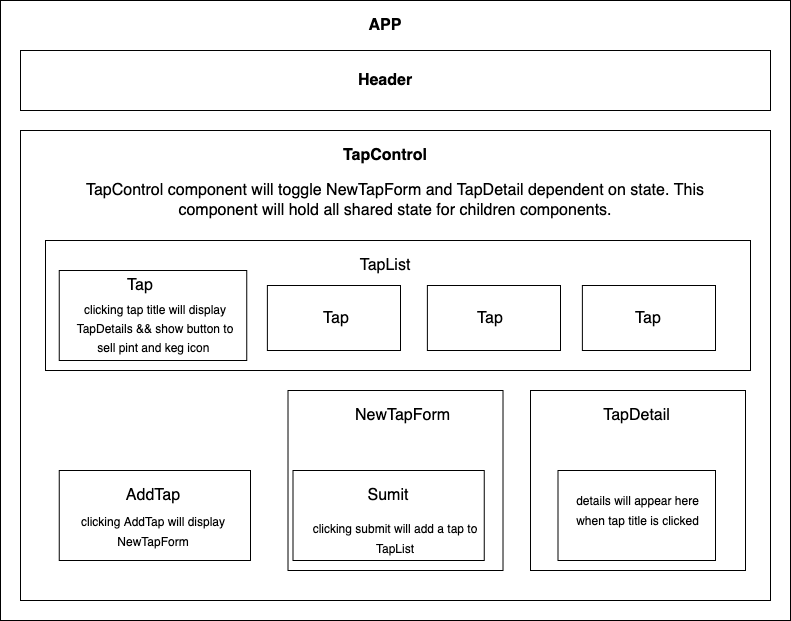

# Taproom

## By Hayley McVay
 

### This project uses a taproom inventory management system as a practice in React fundamentals.

 

## App Diagram

 

 

## Technologies Used

* React
* Javascript
* HTML
* CSS

 

## Description

This project is a practice in state management and React fundamentals using a tap inventory system for an imagined taproom as an example.

 

## Setup/Installation Requirements

* Clone this repository to your local computer.
* Navigate to the project's root directory, `tap-room`, and run `npm install` in your terminal to install the necessary dependencies. 
* Next, run `npm run build` to ensure there are no compiling errors, and then run `npm start` to open the live server (http://localhost:3000) in your browser.

 

## Known Bugs

* None so far

 

## License 

MIT License

Copyright (c) [2022] [Hayley McVay](github.com/hmcvay)

Permission is hereby granted, free of charge, to any person obtaining a copy of this software and associated documentation files (the "Software"), to deal in the Software without restriction, including without limitation the rights to use, copy, modify, merge, publish, distribute, sublicense, and/or sell copies of the Software, and to permit persons to whom the Software is furnished to do so, subject to the following conditions:

The above copyright notice and this permission notice shall be included in all copies or substantial portions of the Software.

THE SOFTWARE IS PROVIDED "AS IS", WITHOUT WARRANTY OF ANY KIND, EXPRESS OR IMPLIED, INCLUDING BUT NOT LIMITED TO THE WARRANTIES OF MERCHANTABILITY, FITNESS FOR A PARTICULAR PURPOSE AND NONINFRINGEMENT. IN NO EVENT SHALL THE AUTHORS OR COPYRIGHT HOLDERS BE LIABLE FOR ANY CLAIM, DAMAGES OR OTHER LIABILITY, WHETHER IN AN ACTION OF CONTRACT, TORT OR OTHERWISE, ARISING FROM, OUT OF OR IN CONNECTION WITH THE SOFTWARE OR THE USE OR OTHER DEALINGS IN THE SOFTWARE.

